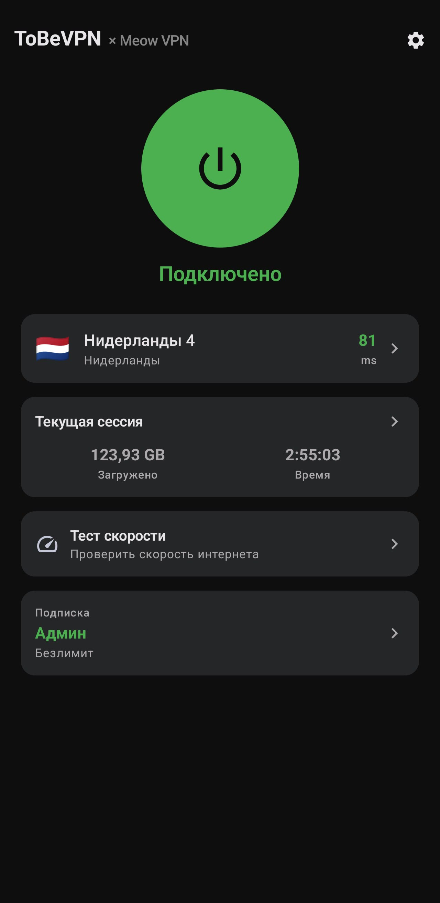
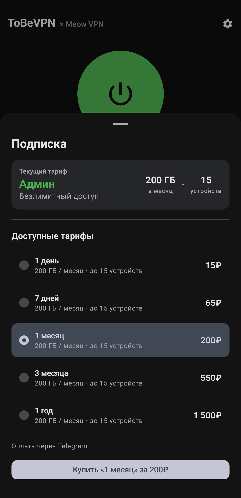
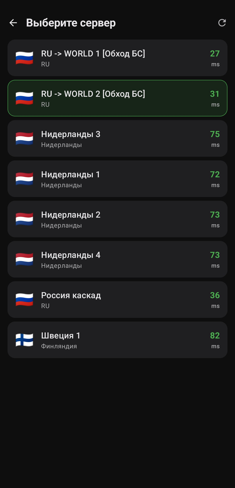
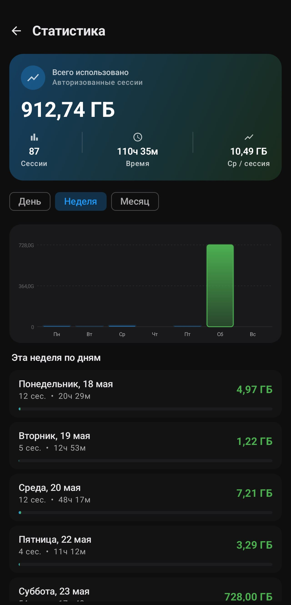
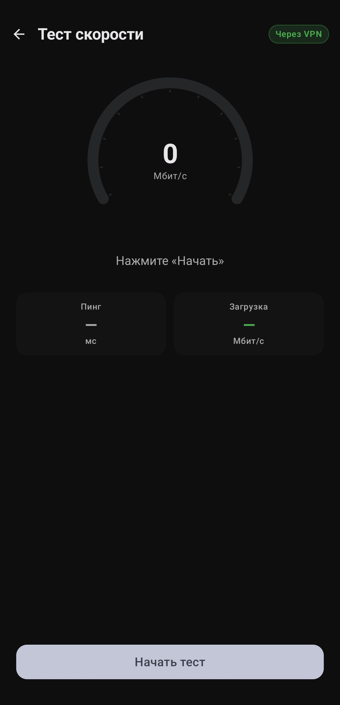
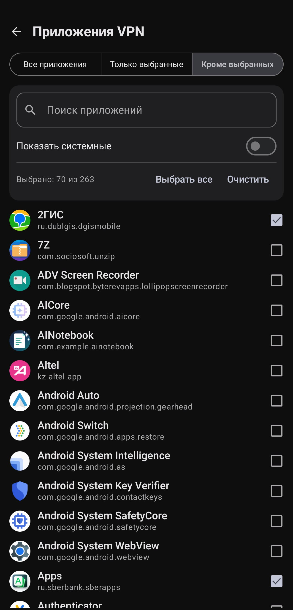

# ToBeVPN

**Современный VPN-клиент для Android с подпиской, выбором серверов и встроенными обновлениями.**

---

## Что это

ToBeVPN — нативный Android-клиент к VPN-сети с защищённым подключением, управлением подпиской и привязкой устройств. Разделение трафика по приложениям, кросс-устройственная пара через QR, встроенный обновлятор, шифрованное локальное хранилище — всё это.

## Главное

| | |
|--|--|
| 🛡️ **Защищённое подключение** | Современный протокол с маскировкой трафика |
| 📲 **Per-app split tunneling** | Off / Whitelist / Blacklist, live-reconnect при изменении |
| 🔐 **Авторизация** | Без логина/пароля, привязка устройств |
| 💳 **Подписка** | Продление и смена тарифа |
| 📺 **Подключение ТВ** | QR-привязка Android TV или другого устройства |
| 🌍 **Выбор сервера** | Список нод с пингом, флагами, статусом online/offline |
| 🚦 **Speed test** | Замер скорости подключения |
| 🔄 **In-app updater** | Проверка и установка обновлений внутри приложения |
| 🌗 **Light / Dark / RU / EN** | Ручное переключение темы и языка |
| 🔒 **Шифрование данных** | Локальная БД зашифрована, ключ в Android Keystore |
| 🛟 **Fallback proxy** | При недоступности основного бэкенда — автоматический повтор через резервный маршрут |

## Скриншоты

  <table>
    <tr>
      <td align="center"><b>Главный экран</b></td>
      <td align="center"><b>Подписка</b></td>
      <td align="center"><b>Серверы</b></td>
    </tr>
    <tr>
      <td></td>
      <td></td>
      <td></td>
    </tr>
    <tr>
      <td align="center"><b>Статистика</b></td>
      <td align="center"><b>Тест скорости</b></td>
      <td align="center"><b>Приложения VPN</b></td>
    </tr>
    <tr>
      <td></td>
      <td></td>
      <td></td>
    </tr>
  </table>

## Безопасность

- Локальная БД зашифрована, ключ хранится в аппаратном Android Keystore.
- Чувствительные данные (токены, ключ подписки, email) исключены из резервного копирования.
- Backend-хосты не хранятся в исходниках — подставляются при сборке.
- Авторизация без долгоживущих токенов на устройстве.

## Связанные репозитории

- **Desktop-клиент:** [ToBeVPN-Desktop](https://github.com/Shoolife/ToBeVPN-Desktop) — Linux / Windows / macOS
- **Android TV-клиент:** [ToBeVPN-Android-TV](https://github.com/Shoolife/ToBeVPN-Android-TV) — Android TV / приставки
- *(планируется)* iOS-клиент

## Roadmap

- [ ] Поддержка протокола Hysteria
- [ ] Auto-server selection по latency
- [ ] iOS-клиент
- [ ] Виджет быстрого подключения для launcher
- [ ] Per-app traffic statistics

## Contributing

Issue welcome. PR — лучше предварительно обсудить через issue. Коммиты — present tense, conventional commits не обязательны но приветствуются.

## Лицензия

Проприетарное приложение. Исходный код предоставляется для прозрачности и self-host'инга — коммерческое использование/перепродажа запрещены.

---

  Сделано с ❤️ командой <b>ToBeVPN × Meow VPN</b>

