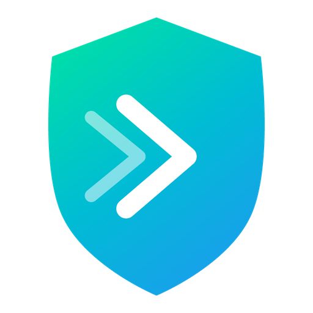

<div align="center">



# ToBeVPN

**Современный VPN-клиент для Android с подпиской, выбором серверов и встроенными обновлениями.**

[](https://github.com/Shoolife/ToBeVPN-Android/releases/latest)
[](https://github.com/Shoolife/ToBeVPN-Android/actions/workflows/build.yml)
[](#)
[](#)
[](#)
[](#)

</div>

---

## Что это

ToBeVPN — нативный Android-клиент к VPN-сети с защищённым подключением, управлением подпиской и привязкой устройств. Разделение трафика по приложениям, кросс-устройственная пара через QR, встроенный обновлятор, шифрованное локальное хранилище — всё это.

## Главное

| | |
|--|--|
| 🛡️ **VLESS Reality** | XRay-core внутри, latest reality / xtls-rprx-vision |
| 📲 **Per-app split tunneling** | Off / Whitelist / Blacklist, live-reconnect при изменении |
| 🔐 **Авторизация** | Без логина/пароля, deep-link flow, HWID-привязка устройств |
| 💳 **Подписка** | Продление и смена тарифа через backend flow |
| 📺 **Подключение ТВ** | QR-привязка Android TV или другого устройства |
| 🌍 **Выбор сервера** | Список нод с пингом, флагами, статусом online/offline |
| 🚦 **Speed test** | Замер скорости подключения |
| 🔄 **In-app updater** | Проверка и установка обновлений внутри приложения |
| 🌗 **Light / Dark / RU / EN** | Compose Material 3, ручное переключение языка |
| 🔒 **SQLCipher-шифрование** | Локальная БД зашифрована, passphrase в Android Keystore |
| 🛟 **Fallback proxy** | При недоступности основного бэкенда — автоматический повтор через резервную proxy-функцию |

## Скриншоты

<div align="center">
  <table>
    <tr>
      <td align="center"><b>Home</b></td>
      <td align="center"><b>Серверы</b></td>
      <td align="center"><b>Приложения VPN</b></td>
      <td align="center"><b>Настройки</b></td>
    </tr>
    <tr>
      <td><sub><i>скриншот скоро</i></sub></td>
      <td><sub><i>скриншот скоро</i></sub></td>
      <td><sub><i>скриншот скоро</i></sub></td>
      <td><sub><i>скриншот скоро</i></sub></td>
    </tr>
  </table>
</div>

## Стек

- **UI:** Jetpack Compose (BOM 2026.03), Material 3, Navigation-Compose
- **Архитектура:** MVVM + Hilt + ViewModel + Repository, single-Activity
- **Корутины / реактивность:** Kotlin Coroutines 1.10, StateFlow / SharedFlow
- **Хранилище:** Room 2.8 (SQLCipher-encrypted) + DataStore Preferences
- **Сеть:** OkHttp 5.3, Retrofit 3.0, Kotlinx Serialization, fallback-interceptor
- **VPN-движок:** XRay-core через gomobile bindings (libv2ray .aar)
- **Безопасность:** Android Keystore (AES-GCM), SQLCipher 4.6, HWID device-binding
- **CI:** GitHub Actions, авто-сборка APK (4 split'а по ABI) + AAB, релиз на тег `v*`

```
app/
├── data/
│   ├── local/         Room + SQLCipher, DataStore prefs
│   ├── remote/        Retrofit, OkHttp, FallbackInterceptor, SubscriptionPinger
│   └── repository/    Auth / Vpn / AppFilter / Usage / Currency / Purchase
├── domain/model/      AuthState, ConnectionState, AppFilterMode, Server, UserPlan
├── presentation/      Compose screens + ViewModels по фиче
├── vpn/               ToBeVpnService, VpnConnectionManager, XRayCore, VlessUrlParser
└── update/            UpdateChecker, UpdateDownloader, UpdateBanner
```

## Сборка

### Требования
- JDK 17+
- Android SDK 36 (build-tools, platform-tools)
- Android Gradle Plugin 9.1 (тянется автоматически)

### Локально

```bash
git clone https://github.com/Shoolife/ToBeVPN-Android.git
cd ToBeVPN-Android
```

Создай `local.properties` в корне проекта:

```properties
sdk.dir=/path/to/Android/Sdk

# Bot backend (обязательно — production builds иначе не соберутся)
bot.api.url=https://your.backend/

# Резервный путь к bot API (опционально). Полный URL proxy-function с параметром ?u=.
fallback.bot.domain=https://<fallback-host>/<function-id>?u=

# Резервный URL подписки (опционально). Полный URL заканчивающийся на ?sub=.
fallback.subs.domain=

# Релизная подпись (опционально для debug)
keystore.path=../tobevpn-release.jks
keystore.password=...
keystore.keyAlias=...
keystore.keyPassword=...
```

Дальше:

```bash
./gradlew installDebug          # debug-сборка → подключенное устройство
./gradlew installRelease        # release-сборка (требует keystore)
./gradlew assembleRelease       # APK-сплиты в app/build/outputs/apk/release/
./gradlew bundleRelease -PdisableAbiSplits   # AAB (резервный формат, CI кладёт в release)
```

> При сборке APK-сплитов Gradle создаёт **4 файла** — `arm64-v8a`, `armeabi-v7a`, `x86_64` плюс универсальный fallback. Это уменьшает размер скачивания на устройстве с 30 МБ до 10–13 МБ.

### CI / Releases

Тег `v*` запускает [workflow](.github/workflows/build.yml), который:
1. Восстанавливает keystore из base64-секрета.
2. Собирает APK-сплиты + AAB параллельно.
3. Переименовывает артефакты в `ToBeVPN-<version>-<abi>-<sha>.apk`.
4. Публикует release assets с APK + AAB.

Секреты репозитория, которые нужны:
- `BOT_API_URL`
- `SIGNING_KEYSTORE_BASE64` / `SIGNING_KEYSTORE_PASSWORD` / `SIGNING_KEY_ALIAS` / `SIGNING_KEY_PASSWORD`
- `FALLBACK_BOT_DOMAIN` / `FALLBACK_SUBS_DOMAIN` *(опционально, если включаешь fallback-маршрутизацию)*

Xray-core обновляется только через обычный APK/AAB app release: обновляется `app/libs/libv2ray.aar`, затем выпускается маленький patch release. [check-xray-core](.github/workflows/check-xray-core.yml) раз в неделю сравнивает upstream Xray-core с последним релизом приложения и создаёт issue, если нужен релиз с обновлённым core.

## Безопасность

- БД зашифрована **SQLCipher 4.6** случайным 32-байтным passphrase'ом.
- Passphrase лежит в **Android Keystore** (AES-256-GCM), wrap'нутый перед записью в SharedPreferences.
- Subscription URL с секретным ключом, auth-токены, email — внутри зашифрованной БД, **исключены** из Auto Backup.
- App filter mode / язык / выбранный сервер / agnostic preferences — попадают в Auto Backup, восстанавливаются при reinstall с тем же Google-аккаунтом.
- Backend-хосты **не** хардкодятся в исходниках — инжектятся при сборке через CI-секреты, иначе билд падает.
- Auth deep-link генерируется на стороне backend'а, локально не хранятся long-lived tokens.

Подробнее — `data/local/DatabasePassphrase.kt`, `xml/backup_rules.xml`, `xml/data_extraction_rules.xml`.

## Связанные репозитории

- **Desktop-клиент:** [ToBeVPN-Desktop](https://github.com/Shoolife/ToBeVPN-Desktop) — Tauri 2 + React (Linux/Windows/macOS)
- *(планируется)* iOS / Android TV — отдельный экран привязки уже в этой кодовой базе

## Roadmap

- [ ] AmneziaWG-протокол как альтернатива VLESS
- [ ] Auto-server selection по latency
- [ ] iOS-клиент
- [ ] Виджет быстрого подключения для launcher
- [ ] Per-app traffic statistics

## Contributing

Issue welcome. PR — лучше предварительно обсудить через issue, особенно если затрагивает VPN-engine или auth-flow. Стиль кода — Kotlin official, форматирование — Android Studio default. Коммиты — present tense, conventional commits не обязательны но приветствуются.

## Лицензия

Проприетарное приложение. Исходный код предоставляется для прозрачности и self-host'инга — коммерческое использование/перепродажа запрещены.

---

<div align="center">
  <sub>Сделано с ❤️ командой <b>ToBeVPN × Meow VPN</b></sub>
</div>
